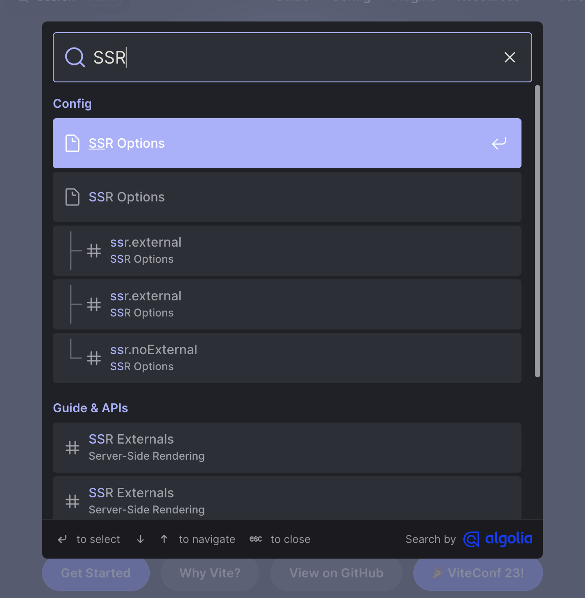
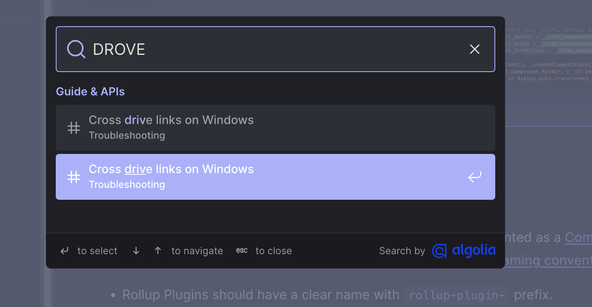

# 基于indexdb的离线全文搜索引擎

## 输入

搜索的输入是keywords，也就是用户输入的关键词,我们以空格为单位将它分解为keyword数组后在索引中查询。将查询之后的结果并集输出。

对于用户的输入，还可以使用`字符串距离算法`进行错误纠正。

## 输出



对于搜索的输出，首先应该是一个文章数组。

我们需要这个关键词对应的信息是：

1. 词干。 也就是和关键词有关系的一个局部整体短语
2. 路由。词干所在这篇文章的路由信息,锚点信息

## Transfrom

怎么将输入变换为输出呢？

1. 分词 Segmenter/Tokenizers

将文章分解成为一个字符串数组，用来对文章的边界进行切分。

2. 过滤（可选）

- 标准化，使得关键词对于大小写不敏感
- 过滤掉无意义的语气词，比如 `the` `a`
- 词干提取，比如搜索 `drove`的时候 `drive`相关的短语应该能被搜索出来



3. 建立倒排索引

倒排索引是什么意思，就是用关键词来查找文章，而不是在通过遍历文章来查询其中的关键词。

```shell
{
  'word1': ['article1', 'article2'],
  'word2': ['article1'],
  'word3': ['article2', 'article3']
}
```

在对关键词进行查询的时候，我们也要对关键词进行分词和过滤，再将得到的关键词数组来查询倒排索引。

## 初步思路

站在巨人的肩膀上！。

### 分词。 

1. 使用 https://naturalnode.github.io/natural/Tokenizers.html，缺点： 不支持中文分词
2. 直接使用 `Intl.Segmenter`, 缺点是不是所有浏览器都兼容

### 过滤

#### 标准化

大小写转换，这个简单

#### 停词表

一个字符串数组，把关键词过滤一遍就行了

参考 https://github.com/goto456/stopwords

#### 词干提取。

1. 直接使用 https://naturalnode.github.io/natural/stemmers.html，不支持中文
2. 没太看到中文库 英语可以把"running"、"runner"、"ran" 提取成 "run"，但是中文可能不太好提取？


### 倒排索引

建立关键词到文章的映射就行了。将映射存入indexdb中。

## 流程。

在SSG生成静态页面的过程中。对于每篇文章执行上述的算法，生成一个映射表。使用script标签将映射表挂到indexdb中。可能需要针对各个SSG框架作插件。

## 参考：

1. https://gist.github.com/inexorabletash/a279f03ab5610817c0540c83857e4295
2. https://dev.to/talolard/want-to-learn-about-webworkers-and-indexeddb-2pph
3. https://github.com/NaturalNode/natural
4. https://naturalnode.github.io/natural/
5. https://github.com/akrylysov/simplefts

## 现有的文档搜索

他们都需要一个backend

1. https://github.com/typesense/typesense
2. https://github.com/algolia